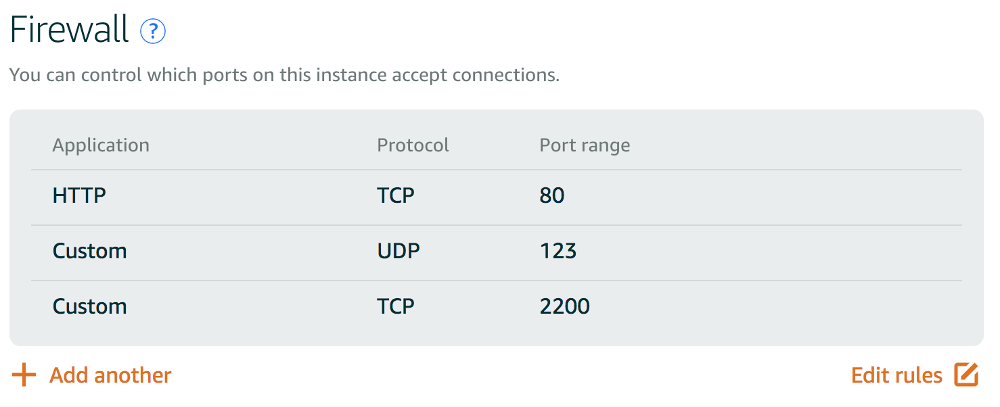

# LinuxServerConfiguration

You will take a baseline installation of a Linux server and prepare it to host your web applications. You will secure your server from a number of attack vectors, install and configure a database server, and deploy one of your existing web applications onto it.

# Why this Project?

A deep understanding of exactly what your web applications are doing, how they are hosted, and the interactions between multiple systems are what define you as a Full Stack Web Developer. In this project, you’ll be responsible for turning brand-new, bare bones, Linux server into the secure and efficient web application host your applications need.


## Instruction


### Initialize your server on [Amazon Lightsail][1]

[1]:https://aws.amazon.com/es/lightsail/

  
 - Step by step:
 
    - Log in
    - Create an instance
    - Choose an instance image: Ubuntu
    - Follow the instructions provide to SSH into your server.
    
### SSH into the server
* From the Account menu on Amazon Lightsail, click on SSH keys tab and download the Default Private Key.
* Move this private key file named LightsailDefaultPrivateKey-*.pem into the local folder ~/.ssh and rename it lightsail_key.rsa.
* In your terminal, type: chmod 600 ~/.ssh/lightsail_key.rsa.
* To connect to the instance via the terminal: ssh -i ~/.ssh/lightsail_key.rsa ubuntu@34.203.28.148, where 34.203.28.148 is the public IP address of the instance.


### Security

 * Update all currently installed packcages (this could take a while)
 ~~~
 sudo apt-get update
 sudo apt-get upgrade
 ~~~
 
 * Configure the Uncomplicated Firewall (UFW)
 ~~~
  sudo ufw status                     <-- to check firewall status
  sudo ufw default deny incoming
  sudo ufw default allow outgoing
  sudo ufw allow 2200/tcp
  sudo ufw allow 80/tcp
  sudo ufw allow 123/tcp
  sudo ufw allow www
  sudo ufw enable
 ~~~
 
 * Change the ssh port from 22 to 2200 and change `permitRootLogin` from `without-password` to `no`

 ~~~
 sudo nano /etc/ssh/sshd_config
 ~~~
 
Change the port number on line 5 from 22 to 2200.
Save and exit using CTRL+X and confirm with Y then press ENTER.
Restart SSH: `sudo service ssh restart`.

* Click on the Manage option of the Amazon Lightsail Instance, then the Networking tab, and then change the firewall configuration to match the internal firewall settings above. 

* Allow ports 80 (TCP), 123(Custom UDP), and 2200(Custom TCP), and deny the default port 22



* You can now login as `ssh -i ~/.ssh/lightsail_key.rsa -p 2200 ubuntu@34.203.28.148` where 34.203.28.148 is the public IP of the instance

### User configuration
 
 * Create a new user name grader in order to the project be reviewed.
 ~~~
 sudo add user grader
 ~~~
 
 * Give grader the permission to sudo.
 ~~~
 sudo nano /etc/sudoers.d/grader
 ~~~
   and inside this file add the text, then save.
 ~~~
 grader ALL=(ALL) NOPASSWD:ALL
 ~~~
 
 * Configura timezone to UTC
 ~~~
 sudo dpkg-reconfigure tzdata
 ~~~
 
### Create an SSH key pair for grader

   - On the local machine:
        Run ssh-keygen
        Enter file in which to save the key (I gave the name grader_key) in the local directory ~/.ssh
        Enter in a passphrase twice. Two files will be generated ( ~/.ssh/grader_key and ~/.ssh/grader_key.pub)
        Run cat ~/.ssh/grader_key.pub and copy the contents of the file
        Log in to the grader's virtual machine
  - On the grader's virtual machine:
        Create a new directory called ~/.ssh (mkdir .ssh)
        Run sudo nano ~/.ssh/authorized_keys and paste the content into this file, save and exit
        Give the permissions: chmod 700 .ssh and chmod 644 .ssh/authorized_keys
        Check in /etc/ssh/sshd_config file if PasswordAuthentication is set to no
        Restart SSH: sudo service ssh restart
  - On the local machine, run: ssh -i ~/.ssh/grader_key -p 2200 grader@34.203.28.148.


### Install and configure

* Install And configure Apache with mod_wsgi
  - While logged as grader, install Apache ```sudo apt-get install apache2```. Enter the IP in the browser if is working, you will see:
  
  
  - Istall the Python 3 mod_wsgi package:  `sudo apt-get install libapache2-mod-wsgi-py3`.
  
  - Enable `mod_wsgi` using: `sudo a2enmod wsgi`.

* Install and configure PostgreSQL

  - While logged as `grader`, install: `sudo apt-get install postgresql`
  
  - PostgreSQL should not allow remote connections. In the  `/etc/postgresql/9.5/main/pg_hba.conf` file, you should see:
    ```
    local   all             postgres                                peer
    local   all             all                                     peer
    host    all             all             127.0.0.1/32            md5
    host    all             all             ::1/128                 md5
    ```
  
  - Enter as `postgres` user: `sudo su - postgres`.
  - Now open the interactive terminal: `psql`
  - Create the `catalog` user with a password and give him the ability to create databases:
    ```
    postgres=# CREATE ROLE catalog WITH LOGIN PASSWORD 'catalog';
    postgres=# ALTER ROLE catalog CREATEDB;
    ```
  - Exit psql: `\q`
  - Come back to the `grader` user writing: `exit`
  - Create a new user named `catalog`with: `sudo adduser catalog` and fill the information.
  - Give `catalog` sudo permission to sudo adding on this line:
    ```
    root    ALL=(ALL:ALL) ALL
    grader  ALL=(ALL:ALL) ALL
    catalog  ALL=(ALL:ALL) ALL
    ```
    
* Create  a database while logged as `catalog`: `createdb catalog`

  - Run `psql` and then `\l` to show the list of the databases. The output should be like this:
   ```
                                    List of databases
     Name    |  Owner   | Encoding |   Collate   |    Ctype    |   Access privileges   
  -----------+----------+----------+-------------+-------------+-----------------------
   catalog   | catalog  | UTF8     | en_US.UTF-8 | en_US.UTF-8 | 
   postgres  | postgres | UTF8     | en_US.UTF-8 | en_US.UTF-8 | 
   template0 | postgres | UTF8     | en_US.UTF-8 | en_US.UTF-8 | =c/postgres          +
             |          |          |             |             | postgres=CTc/postgres
   template1 | postgres | UTF8     | en_US.UTF-8 | en_US.UTF-8 | =c/postgres          +
             |          |          |             |             | postgres=CTc/postgres
  (4 rows)
   ```
  - Exit psql: `\q`.
  - Switch back of user using: `exit`.


* Install Git
  -While logged as `grader`, install `git`: `sudo apt-get install git`.


### Deploy

* Clone the repository
- While logged as `grader`, `create /var/www/catalog` directory.

* Ngnix

We can use ngnix instead of Apache, configuration steps can be found here

[ngix tutorial][2]

[2]:https://www.digitalocean.com/community/tutorials/how-to-serve-flask-applications-with-uwsgi-and-nginx-on-ubuntu-16-04

* Postgresql
`sudo apt-get install postgresql`

* Remove remote connections

Create a new database with limited permission on your catalog application dabase.

` https://help.ubuntu.com/community/PostgreSQL`

or

STEP BY STEP COMMING SOON..

### Deploy the catalog project.
http://34.203.28.148/
